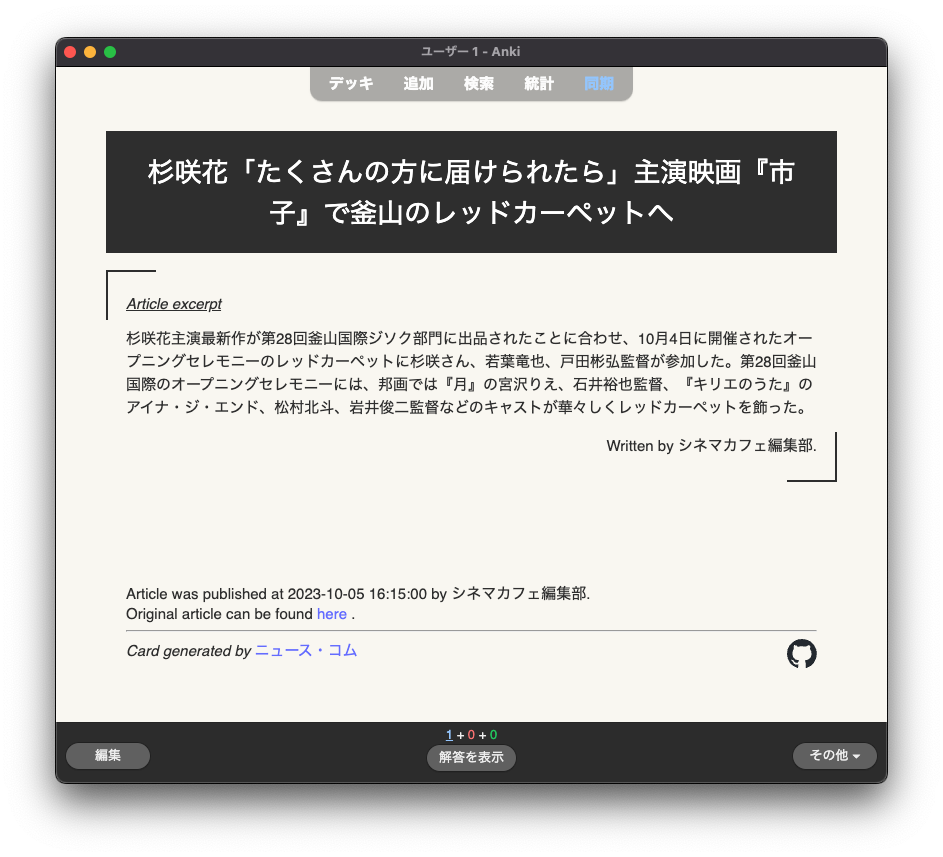

<svg fill="none" viewBox="0 0 600 300" width="600" height="300" xmlns="http://www.w3.org/2000/svg">
  <foreignObject width="100%" height="100%">
    <div xmlns="http://www.w3.org/1999/xhtml">
      <style>
        .title {
            --black-ink: #2e2e2e;
            --newspaper: #f9f7f1;
              margin: 0;
              padding: 20px 0;
              color: var(--black-ink);
              font-size: 3.6em;
              font-weight: bold;
              text-shadow: -1px -1px 0 var(--newspaper),
                  1px -1px 0 var(--newspaper),
                  -1px 1px 0 var(--newspaper),
                  1px 1px 0 var(--newspaper),
                  2px 2px 0 var(--black-ink),
                  3px 3px 0 var(--black-ink),
                  4px 4px 0 var(--black-ink),
                  5px 5px 0 var(--black-ink);
              text-align: center;
        }
      </style>
      <div>
        <p class="title">ニュース・コム</p>
      </div>
    </div>
  </foreignObject>
</svg>

# :newspaper: ニュース

Practice reading real Japanese from news articles published in Japan.

## Anki Integration



## Local Development

1. Clone the repository
```sh
git clone git@github.com:TomPlum/nyuusu.git
```

2. Install NPM dependencies
```sh
npm install
```

3. Run the local development server
```sh
npm run dev
```

## Data Sources

- The Newscatcher API is used to fetch news article information used in this application. See https://www.newscatcherapi.com/ for more info.